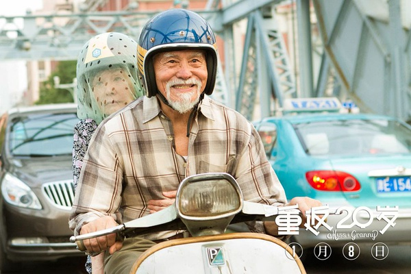
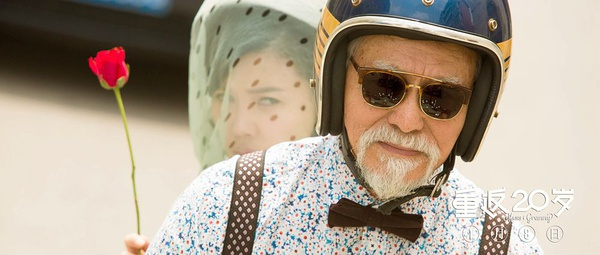
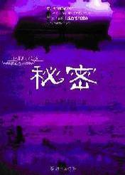

% Movie : 重返20岁
% 胡浩源 haoyuan.huhy@gmail.com
% 2015年2月22日

# 重返20岁

## subtitle
> 东野圭吾<秘密>的童话版本，对称的幸福生活下去 

## Who : main actiors

- 孟丽君:杨子珊, 年轻化版的沈梦君
- 李大海:王德顺, 帅气的老潮人, 沈梦君的爱慕者

## What : main plot
- 被家庭琐事窒息的沈梦君， 获得了20岁的容颜
- 成为受欢迎的歌手， 获得爱情
- 为救孙子， 重新成为老人

## Key moment
- 音乐节, 杨子珊唱《偿还》

## Key words
- 其实光一直都在， 我们只是需要一点时间来适应黑暗

## Key Image

## Key Image

## Key Image

## Notes
相对于《秘密》那种压抑窒息的返老还童， 我们还是更喜欢看一个童话。

青春如果无悔， 那该多无趣啊。

## End

重要的不是我拥有你， 而是拥有和你在一起的回忆。
